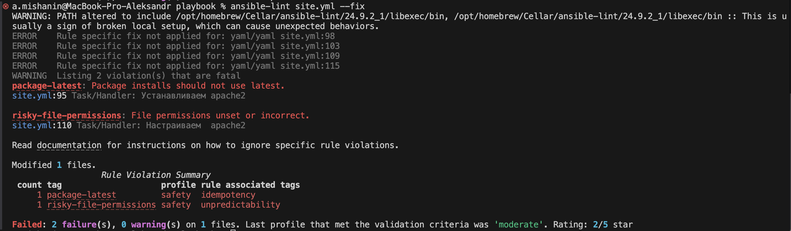
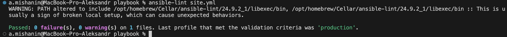
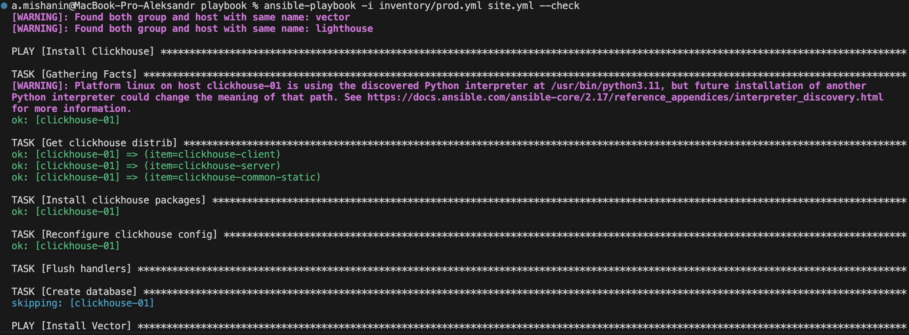
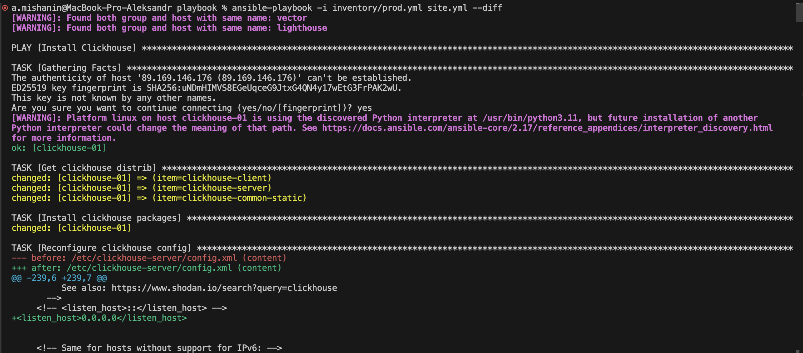
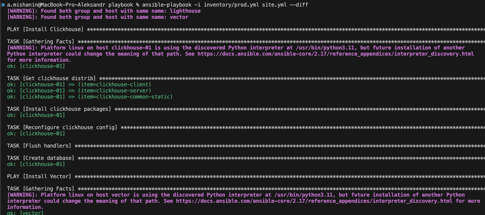

# Домашнее задание к занятию 3 «Использование Ansible»

## Подготовка к выполнению

1. Подготовьте в Yandex Cloud три хоста: для `clickhouse`, для `vector` и для `lighthouse`.
2. Репозиторий LightHouse находится [по ссылке](https://github.com/VKCOM/lighthouse).

## Основная часть

1. Допишите playbook: нужно сделать ещё один play, который устанавливает и настраивает LightHouse.
2. При создании tasks рекомендую использовать модули: `get_url`, `template`, `yum`, `apt`.
3. Tasks должны: скачать статику LightHouse, установить Nginx или любой другой веб-сервер, настроить его конфиг для открытия LightHouse, запустить веб-сервер.
4. Подготовьте свой inventory-файл `prod.yml`.
5. Запустите `ansible-lint site.yml` и исправьте ошибки, если они есть.
6. Попробуйте запустить playbook на этом окружении с флагом `--check`.
7. Запустите playbook на `prod.yml` окружении с флагом `--diff`. Убедитесь, что изменения на системе произведены.
8. Повторно запустите playbook с флагом `--diff` и убедитесь, что playbook идемпотентен.
9. Подготовьте README.md-файл по своему playbook. В нём должно быть описано: что делает playbook, какие у него есть параметры и теги.
10. Готовый playbook выложите в свой репозиторий, поставьте тег `08-ansible-03-yandex` на фиксирующий коммит, в ответ предоставьте ссылку на него.

---

### Как оформить решение задания

Выполненное домашнее задание пришлите в виде ссылки на .md-файл в вашем репозитории.

---

### Ответ

- Запустите `ansible-lint site.yml` и исправьте ошибки, если они есть.





- Попробуйте запустить playbook на этом окружении с флагом `--check.



- Запустите playbook на `prod.yml` окружении с флагом `--diff`. Убедитесь, что изменения на системе произведены.



- Повторно запустите playbook с флагом `--diff` и убедитесь, что playbook идемпотентен.



## Проект Clickhouse-Vector-Lighthouse

Репозиторий для выполнения домашнего задания

## Версия

08-ansible-03-yandex
  
## Условия установки

- **Ansuble 2.10+**

## Настройка

Ссылка на файлы для изменнения значений по умолчанию

- [playbook/group_vars/clickhouse/vars.yml](playbook/group_vars/clickhouse/vars.yml)

- [playbook/group_vars/vector/vars.yml](playbook/group_vars/vector/vars.yml)

Например, если нам нужно поменять версию дистрибутивов Clickhouse

        clickhouse_version: "24.9.2.42"

В файле [playbook/inventory/prod.yml](playbook/inventory/prod.yml), вы можете описать детали узла. В этом файле узлы разделены на три  группы `vector`, `ligthhouse` и `clichouse`.
`ansible_host` используется  ansible-ом для соединения узлов с целью запуска сценария. `ansible_user` используется для определения от какого пользователя будет осуществленно соединение.

Пример:

```
   vector:
      hosts:
        vector:
          ansible_host: 10.1.137.5
          ansible_user: admin1
```

## Установка

Для развертывания с помощью ansible playbook выполнить следующую команду:

`ansible-playbook -i inventory/prod.yml site.yml`
